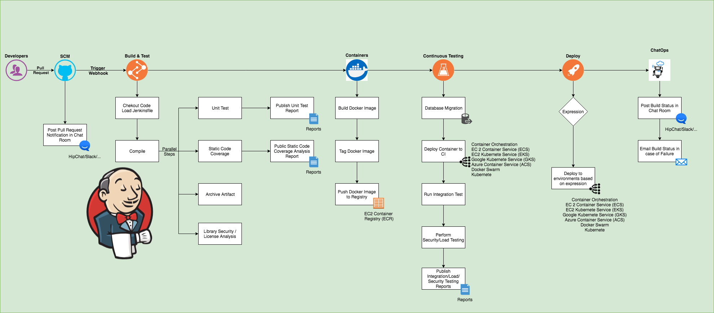

# Jenkins CI/CD


## What is CI/CD
CI/CD is a method to frequently deliver apps to customers by introducing automation into the stages of app development. The main concepts attributed to CI/CD are continuous integration, continuous delivery, and continuous deployment.

### Continuous Intergration (CI) 
the goal is to have multiple developers working simultaneously on different features of the same app. (CI) helps developers merge their code changes back to a shared branch, or "trunk," more frequently—sometimes even daily. Once a developer’s changes to an application are merged, those changes are validated by automatically building the application and running different levels of automated testing, typically unit and integration tests, to ensure the changes haven’t broken the app

### Continuous Delivery (CD)  
Continuous delivery automates the release of that validated code to a repository. So, in order to have an effective continuous delivery process, it’s important that CI is already built into your development pipeline. The goal of continuous delivery is to have a codebase that is always ready for deployment to a production environment. Every stage—from the merger of code changes to the delivery of production-ready builds—involves test automation and code release automation. At the end of that process, the operations team is able to deploy an app to production quickly and easily.

### Continuous Deployment
As an extension of continuous delivery, which automates the release of a production-ready build to a code repository, continuous deployment automates releasing an app to production. Because there is no manual gate at the stage of the pipeline before production, continuous deployment relies heavily on well-designed test automation

## What is Jenkins
Jenkins is an open-source Continuous Integration server written in Java for orchestrating a chain of actions to achieve the Continuous Integration process in an automated fashion. Jenkins supports the complete development life cycle of software from building, testing, documenting the software, deploying, and other stages of the software development life cycle.


### Generating an SSH Key 
Follow my steps here for this 


### Jenkins Configuration
Here are the steps to successfully create a Jenkins job:
- Create a `New Item` and select `Freestyle Project`
- Discard Old Builds: `3`
- Restrict where project can be run: `sparta-ubuntu-node`
- Source Code Management
    - Repository URL: Insert the link of the Repository created `https://github.com/sc18kg/SRE_jenkins_cicd`
    - Credential: `Add > Jenkins > Key` Select option to input ssh key and paste in the private key
- Branches to build: `*/main`
- Github Hook trigger for GITScm polling: `enable`
- Provide Node and npm bin/ folder: `enable`
- Build `execute shell` insert commands here to be completed by Jenkins

### Github Configuration
Here are the steps to create the SSH connection between Github and Jenkins:
- First make sure to follow the steps above on `Generating an SSH Key`
- Have a Github Repository you would like to connect using ssh
- Click on the Repository and select `Settings`
- From the menu on the lefthand side, Select `Deploy Keys` then `Add Deploy Key`
- Here you want to copy your public key from the created ssh key e.g. `kieron_jenkins.pub`
- Now select `Add key`

### Setting up the Webhook
Once the previous steps has been completed, we are now ready to create the webhook.
- Click on the Repository and select `Settings`
- From the menu on the lefthand side, Select `Webhooks` then `Add Webhook`
- Payload URL:`IP.ADDRESS.HERE:8080/github-webhook` for our instance we used the Public IP of the jenkins server, followed by port `8080` for jenkins and finished off with the `/github-webhook` which is required.
- Content type: `application/json` for this example id does not matter
- Let me select individual events: `enable`
- Pull requests: `enable`
- Pushes: `enable`
- Active: `enable`
- `Add webhook`

### Run app from a new EC2 instance with Jenkins
Once everything has been set up, We are able to use Jenkins to configure a new EC2 instance using the previous settings and then in the `Execute Shell` use the following code:
```
ssh -A -o  "StrictHostKeyChecking=no" ubuntu@ec2-34-244-37-102.eu-west-1.compute.amazonaws.com << EOF
git clone https://github.com/sc18kg/SRE_jenkins_cicd.git
cd SRE_jenkins_cicd
chmod +x environment/app/provision.sh
./environment/app/provision.sh
cd app
export DB_HOST=10.105.2.50:27017/posts
npm install
npm start
```
